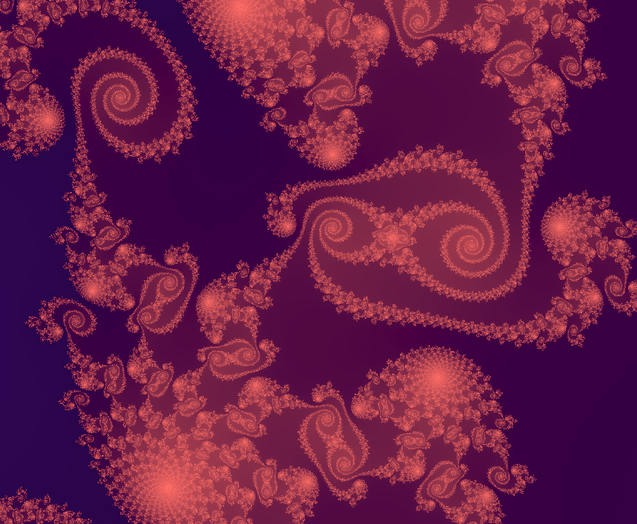

# Fractal Hunt
Find the nicest looking fractal you can.

## Resources:
  - glsl canvas viewer for VSCode, https://marketplace.visualstudio.com/items?itemName=circledev.glsl-canvas
  - Syntax highlighting for glsl, https://marketplace.visualstudio.com/items?itemName=slevesque.shader
  - Intro to glsl shader language, https://www.youtube.com/watch?v=f4s1h2YETNY&t=980s
  - Fun color gradient maker, http://dev.thi.ng/gradients/
  - Wikipedia page on Mandelbrot sets, https://en.wikipedia.org/wiki/Mandelbrot_set
  - Wikipedia page on Julia sets, https://en.wikipedia.org/wiki/Julia_set

## Inspiration:
  - https://en.wikipedia.org/wiki/Category:Dick%27s_Picks_albums (Specifically Volumes 13-18)

## Example:
Somewhere in the mandelbrot set. Generated by mandelbrot_example.glsl.

